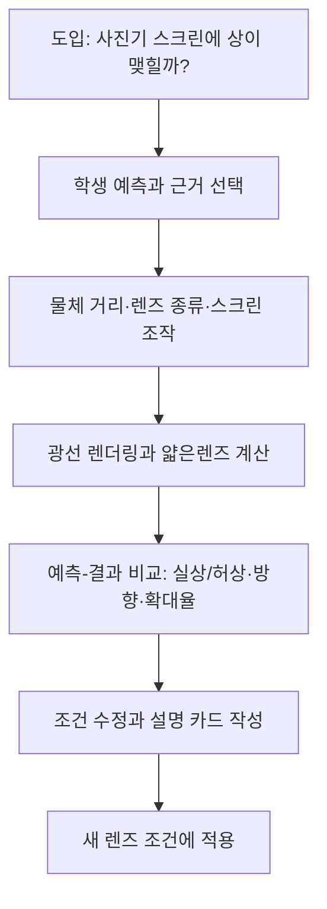

# 05. 빛을 설계하는 광학 공방

> 작성일: 2026-09-10 · 상태: 제작 전 설계 초안 v0.1  
> 상위 문서: [전체 목록](README.md) · [공통 설계 기준](00-shared-design-principles.md)

## 1. 제품 목표

학생이 물체·얇은 렌즈·스크린을 한 광학대에 놓고, 광선 그림을 근거로 상의 위치와 크기를 예측한 뒤 계산 결과와 비교합니다.

첫 버전은 근축 기하광학과 얇은렌즈 근사만 다룹니다. 파동광학, 회절, 간섭, 색수차와 실제 렌즈 설계는 후속 범위입니다.

앱의 성공 행동은 “렌즈를 만져 본다”가 아니라 “조건을 말하고, 상의 성질을 예측하고, 식의 부호와 결과로 설명을 고친다”입니다.

## 2. 권장 대상과 선수 개념

- 권장 학년: 중학교 심화 또는 고등학교 물리 선택 과목
- 권장 차시: 45~50분 1차시
- 선수 개념: 직선의 기울기, 비례, 단위 환산, 빛의 직진, 초점과 실상·허상의 기초 용어
- 선택 선수 개념: 굴절률과 스넬의 법칙을 배웠다면 렌즈가 광선을 꺾는 이유를 연결할 수 있음
- 교육적 경계: 전문 카메라의 다중 렌즈 최적화나 시력 진단 도구가 아님

## 3. 학습 목표

차시가 끝나면 학생은 다음을 할 수 있어야 합니다.

1. 볼록·오목 얇은렌즈와 초점 위치를 광선 그림에서 구별한다.
2. 물체 거리 `d_o`, 상 거리 `d_i`, 초점 거리 `f`를 같은 길이 단위로 기록한다.
3. `1/f = 1/d_o + 1/d_i`를 사용해 상 거리의 부호와 크기를 예측한다.
4. `m = h_i/h_o = -d_i/d_o`로 확대율과 상의 방향을 설명한다.
5. 스크린에 맺히는 실상과 눈으로만 보이는 허상을 조건과 증거로 구분한다.
6. `d_o=f`에서 상 거리가 유한하지 않다는 모델 경계를 말하고, 입력을 바꾸어 재실행한다.

## 4. 주요 오개념과 교정 장치

| 오개념 | 관찰하게 할 반례 | 피드백 문장 |
|---|---|---|
| 렌즈는 언제나 스크린에 선명한 상을 만든다 | `d_o < f`인 볼록렌즈 | “광선이 실제로 만나는가, 뒤로 연장해야 만나는가?” |
| 상이 커지면 항상 초점에 가까워진다 | 물체를 `f` 안팎으로 이동 | “크기와 위치는 같은 변화인가?” |
| 오목렌즈의 초점은 광선이 실제로 만나는 점이다 | 발산 광선을 뒤로 연장 | “점선 연장이 필요한 이유를 표시해 보세요.” |
| 부호는 장식이므로 버려도 된다 | 허상·도립상 사례 | “`d_i`의 부호가 상의 위치와 어떤 관계인가?” |
| `d_o=f`를 넣으면 상이 멀리 있는 값으로 계산된다 | 분모가 0에 가까운 입력 | “이 경우는 수치 오차가 아니라 모델의 특수 경계입니다.” |
| 렌즈가 두꺼울수록 반드시 초점거리가 짧다 | 얇은렌즈는 곡률·굴절률을 고정 | “첫 버전은 두께가 아니라 `f`를 조작합니다.” |

## 5. 한 차시 흐름

| 시간 | 교사·학생 활동 | 성취 증거 |
|---:|---|---|
| 0~5분 | 스크린에 상이 생기는 조건을 개인 예측 | 예측 카드와 근거 한 가지 |
| 5~12분 | 광학대의 축·초점·거리 읽기 | 단위가 붙은 입력 기록 |
| 12~25분 | 과제 1, 볼록렌즈 상 위치 조작 | 예상값과 계산값 비교 |
| 25~35분 | 과제 2, 스크린·허상 판별 | 광선 교차 여부 설명 |
| 35~44분 | 과제 3, 카메라 초점 설계 | 제약을 만족하는 설정 |
| 44~50분 | 다른 조건에 재적용, 출구 티켓 | 식·그림·문장 연결 |

## 6. 최소 과제

### 과제 1: 초점을 맞춰라

- 주어진 값: `f=100 mm`, 물체 높이 `20 mm`, `d_o=300 mm`
- 학생 행동: 상이 맺힐 위치를 먼저 눈금으로 표시하고 실행
- 기대 결과: `d_i=150 mm`, `m=-0.5`, 도립·축소 실상
- 실패 회복: 초점 위치와 중심 광선의 두 단서를 차례로 공개

### 과제 2: 스크린에 잡히지 않는 상

- 주어진 값: `f=100 mm`, `d_o=60 mm`
- 학생 행동: 스크린을 움직인 뒤 “실상/허상/판정 불가” 중 선택
- 기대 결과: `d_i=-150 mm`, `m=+2.5`, 정립·확대 허상
- 핵심 질문: 상의 위치가 음수인 것이 계산 오류인지, 렌즈 앞쪽의 가상 위치인지 설명

### 과제 3: 작은 카메라 설계

- 조건: 센서면은 렌즈 뒤 `120 mm`, 물체 높이는 `10 mm`
- 조작: `f` 선택, 물체 거리 입력, 센서면 이동 제한
- 기대 결과: `1/f=1/d_o+1/120`을 만족하는 조합을 찾고 허용오차를 보고
- 제한: 자동으로 최적값을 찍어 주지 않으며, 한 조건을 바꾸면 예측을 다시 쓰게 함

### 선택 과제: 무한대 대상

- 물체를 광축과 평행한 입사광으로 바꾸고 `d_o=∞` 프리셋을 제공
- 기대 결과: 상은 반대쪽 초점에 놓이고 확대율 계산은 유한 물체 높이 모델에서 제외

## 7. 화면과 조작

- 상단: 앱명, 현재 과제, 작은 `업데이트 내역` 버튼
- 중앙: 밝은 배경의 광학대, 광축, 눈금, 물체·렌즈·스크린·실선/점선 광선
- 우측 또는 하단: 렌즈 종류, `f`, `d_o`, 물체 높이, 스크린 위치 입력
- 하단: 예측 입력, 계산 펼치기, `실행하고 비교` 버튼
- 현재 단계의 필수 버튼은 `실행하고 비교` 하나만 `gi-pulse` 계열 아우라로 강조
- `prefers-reduced-motion`에서는 펄스 대신 굵은 테두리와 “다음 필수 행동” 라벨로 표시
- 밝은 테마를 유지하며 VoiceOver 구현·검증은 범위에서 제외합니다. 키보드, 초점, 텍스트 대안과 모션 감소는 검증 대상입니다.
- 드래그와 숫자 입력을 함께 제공하고, 눈금 이동은 키보드 화살표로 1 mm 단위 조절
- 색상만으로 실상·허상을 구분하지 않고 라벨, 선 종류, 부호 표를 함께 표시
- 작은 화면에서는 광학대 → 입력 → 예측 → 결과 순서로 세로 배치

## 8. 상태·입력·출력·단위·경계

### 상태

`lensType`, `f_m`, `objectDistance_m`, `objectHeight_m`, `screenDistance_m`, `objectAtInfinity`, `prediction`, `runHistory`, `feedbackStep`, `reducedMotion`을 세션 메모리에서 관리합니다.

### 입력과 단위

| 입력 | 단위 | 제안 범위 | 비고 |
|---|---|---:|---|
| 초점 거리 `f` | m 내부, mm 표시 | -0.5~0.5 m | `f>0` 수렴, `f<0` 발산 |
| 물체 거리 `d_o` | m 내부, mm 표시 | 0.03~5 m | 실제 물체는 `d_o>0` |
| 물체 높이 `h_o` | m 내부, mm 표시 | 0.001~0.2 m | 0 금지 |
| 스크린 위치 | m 내부, mm 표시 | -1~5 m | 렌즈 앞쪽 음수 허용 |

### 계산식과 알고리즘

1. 표시 단위를 SI 단위로 변환하고 `f=0`, `d_o≤0`, `h_o≤0`을 역수 계산 전에 거부한다.
2. `objectAtInfinity=true`이면 유한 물체식 대신 `d_i=f`로 처리하고, 유한 물체 높이를 가정한 `m`과 `h_i`는 표시하지 않는다.
3. 유한 물체면 `denom = 1/f - 1/d_o`를 계산하고 `d_i=1/denom`으로 구한다.
4. `|denom| < epsilon_model`이면 `d_o=f` 또는 그 주변의 “매우 먼 유한상”을 구분해 표시한다. `epsilon_model`의 단위는 `m^-1`이며, 정확히 같은 값은 초점면 경계 카드로 표시한다.
5. `m=-d_i/d_o`, `h_i=m*h_o`를 계산한다.
6. `d_i>0`이면 실상, `d_i<0`이면 허상으로 분류한다.
7. 렌즈 종류와 입력의 부호 불일치를 감지해 수정 안내를 표시한다.
8. 계산 결과를 광선 샘플과 표에 전달한다. 렌더링 프레임 시간은 계산 시간 간격이 아니다.

### 경계와 오류

- `f=0`, `d_o≤0`, `h_o≤0`, 비수치 문자열은 즉시 거부합니다.
- `d_o=f`는 임의의 큰 수로 대체하지 않고 “평행 출사 근사”로 표시합니다.
- 광선이 캔버스 밖으로 나가면 계산은 유지하고 뷰포트만 축소합니다.
- WebGL 실패 시 2D SVG 광선·표·텍스트 판별 화면으로 학습 흐름을 유지합니다.
- 이 모델은 근축·얇은렌즈·단색광을 가정하며 주변부 광선 오차와 수차를 다루지 않습니다.
- 런타임 AI 호출과 계정·영구 저장은 사용하지 않고, 실험 기록은 현재 세션에서만 유지합니다.
- 기능별 코드는 한 파일 500줄 미만을 목표로 분리합니다.

## 9. Three.js 역할

- OrthographicCamera로 광학대 좌표와 화면 픽셀의 대응을 단순화하는 2D 도구를 빌립니다. 3D 광학 공간을 계산하는 장치가 아닙니다.
- 렌즈는 계산된 곡선이 아닌 교육용 얇은 표식으로, 광선은 엔진 결과에서 생성합니다.
- 드래그는 광학대 좌표로 역변환하고 입력 상태를 갱신합니다.
- 실상은 연속선, 허상 연장은 점선, 광축은 별도 패턴으로 렌더링합니다.
- 계산 엔진은 Three.js와 분리해 동일한 결과를 SVG 대체 화면에서도 사용합니다.

## 10. Images 2.5 자산 계획

과학적 광선, 눈금, 초점 표시는 생성 이미지가 아니라 계산 렌더링으로 만듭니다.

| 종류 | 예상 수량 | 기준과 변형 |
|---|---:|---|
| 광학 공방 배경 컷 | 1 | 밝은 목재·청록 금속·텍스트 없는 작업대 유지 |
| 카메라·확대경 맥락 카드 | 4 | 기준 구도 유지, 사용 물체만 변형 |
| 오개념 비교 삽화 | 3 | 실상/허상/스크린 실패의 맥락만 제공 |
| 도움말 아이콘 | 6 | 렌즈·스크린·초점·눈금 등 단순 형태 |

프롬프트 1: “bright educational optics workshop, clean wooden optical bench, small convex and concave lens holders, soft daylight, no labels, no formulas, calm classroom illustration, consistent camera angle”.

프롬프트 2: “same educational optics workshop composition, replace only the object with a simple camera, magnifying glass, candle, or toy arrow, bright background, no text, no measurement marks, textbook illustration”.

검수 기준은 불변 배경·조명·물체 방향 유지, 글자 왜곡 없음, 과학 도형을 이미지가 대신하지 않음, alt와 “맥락용 재구성” 캡션입니다.

## 11. 피드백과 성취 증거

- 즉시 피드백은 정답 숫자보다 “부호→교차→스크린” 순서의 단서를 우선합니다.
- 두 번째 시도에서 계산식 펼치기, 세 번째 시도에서 부분 광선 힌트를 제공합니다.
- 성취 증거는 예측 카드, 입력 단위, 한 번의 오답 수정, 새 조건 적용, 설명 문장입니다.
- 점수 대신 과제별 상태 `예측함/비교함/설명함/적용함`을 세션에 기록합니다.
- 교사는 학생이 `d_o=f`를 오류로 고치지 않고 모델 경계로 설명했는지 확인합니다.

## 12. 모듈과 데이터 구조

- `domain/opticsTypes.ts`: 부호 규약, 단위, 허용 범위
- `engine/thinLens.ts`: 계산식, 경계, 분류
- `engine/raySampler.ts`: 세 개 기준 광선 샘플
- `scenarios/opticsTasks.ts`: 과제 입력·힌트·기대 설명
- `renderers/opticsScene.ts`: Three.js 광학대
- `components/PredictionPanel.tsx`: 예측·근거·비교
- `components/UpdateHistory.tsx`: 개발·개선 날짜와 내역

예시 데이터는 `{ id, lensType, f_m, objectDistance_m, objectHeight_m, targetScreen_m, sourceIds, promptVersion }` 형태로 둡니다.

## 13. MVP와 후속

MVP는 한 렌즈, 단일 광축, 단색 근축 광선, 세 핵심 과제, 세션 기록, SVG 대체 화면, 밝은 테마, 키보드와 모션 감소를 포함합니다.

후속은 두 얇은렌즈 조합, 조리개와 심도, 파동광학의 간섭·회절, 색수차, 입체 광학대 확장입니다. 후속에서 실제 유효초점면과 수차를 도입할 때도 기존 부호 규약과 모델 경계를 다시 검토합니다.

## 14. 검증 사례

다음은 구현 후 실행할 제안 사례이며 통과 결과가 아닙니다.

| 사례 | 입력 | 기대 결과 |
|---|---|---|
| V1 수렴렌즈 실상 | `f=0.1 m`, `d_o=0.3 m` | `d_i=0.15 m`, `m=-0.5` |
| V2 초점면 경계 | `f=0.1 m`, `d_o=0.1 m` | 분모 0 경계, 유한 상 거리 미표시 |
| V3 수렴렌즈 허상 | `f=0.1 m`, `d_o=0.06 m` | `d_i=-0.15 m`, `m=+2.5` |
| V4 발산렌즈 | `f=-0.1 m`, `d_o=0.3 m` | `d_i≈-0.075 m`, 정립·축소 허상 |
| V5 단위 입력 | `f=100 mm`, `d_o=300 mm` | m 입력과 같은 분류·비율 |
| V6 잘못된 입력 | `d_o=0`, `f=0` | 계산 중단, 원인별 안내 |

수치 오차 허용범위와 프레임 성능 목표는 프로토타입에서 기준 구현과 측정한 뒤 확정합니다.

## 15. 위험과 미결정

- 위험: 학생이 광선 그림을 실제 파동의 전체 설명으로 오해할 수 있음 → 화면 상단에 근축 기하광학 범위를 고정 표시
- 위험: `d_o=f`에서 무한대 표시가 화면 밖으로 사라질 수 있음 → 별도 경계 카드와 축척 프리셋
- 위험: 드래그와 숫자 입력이 서로 다른 값을 가질 수 있음 → 단일 상태 원천과 마지막 입력 출처 표시
- 미결정: 초점면·무한대 대상의 접근성 높은 텍스트 설명 수준
- 미결정: 실제 카메라 맥락 카드의 사진풍/일러스트풍 선택
- 미결정: 브라우저별 WebGL 성능과 SVG 전환 기준

## 16. 출처와 확인 상태

- [OpenStax, Thin Lenses](https://openstax.org/books/university-physics-volume-3/pages/2-4-thin-lenses): 얇은렌즈 근사와 초점·광선 설명 확인
- [OpenStax, Image Formation by Lenses](https://openstax.org/books/college-physics-2e/pages/25-6-image-formation-by-lenses): 얇은렌즈 식과 배율·부호 규약 확인
- 확인 상태: 설계 단계의 문헌 대조 완료. 엔진 수치·브라우저 성능·학생 학습 효과는 미검증

## 17. 변경 이력

| 날짜 | 버전 | 내용 |
|---|---|---|
| 2026-09-10 | 0.1 | 얇은렌즈 근축 기하광학 MVP 설계 초안 작성 |
