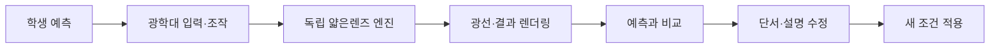

# 빛을 설계하는 광학 공방 — 구현 계획

> 작성일: 2026-09-12 · 상태: Open Design 시안 검토 반영, 본 구현 착수 전 계획 v0.2  
> 근거: [공통 설계 기준](00-shared-design-principles.md), [광학 공방 설계](05-optics-workshop.md)

## 1. 목표와 범위

중학교 심화~고등학교 물리 선택 학생이 광학대에서 물체·얇은렌즈·스크린을 조작하고, **예측 → 실행 → 광선/계산 비교 → 설명 수정**을 완료하는 단일 페이지 정적 웹앱을 만든다.

MVP에는 볼록·오목 얇은렌즈, 세 핵심 과제, 단위가 붙은 입력, 세션 안의 활동 기록, 키보드 조작, 모션 감소 대응, SVG 대체 화면을 포함한다. 파동광학, 두꺼운 렌즈, 다중 렌즈, 영구 저장, 로그인, 점수화, AI 채점과 런타임 AI 호출은 제외한다.



## 2. 구현 원칙

- 내부 계산 단위는 m, UI 표시는 mm로 통일한다. 변환은 입력 경계에서 한 번만 한다.
- 렌더러는 계산하지 않는다. `engine`이 만든 결과만 Three.js 또는 SVG가 표현한다.
- `d_o=f`는 임의의 큰 값으로 치환하지 않는다. 정확한 경계와 근접한 매우 먼 유한상을 구별해 카드로 표시한다.
- 실상은 연속선, 허상 연장은 점선, 광축은 별도 패턴으로 함께 표시한다. 색은 보조 수단일 뿐이다.
- 현재 단계에서 필요한 `실행하고 비교` 버튼 하나만 `gi-pulse`로 강조하며, 모션 감소 환경에서는 굵은 테두리와 “다음 필수 행동” 문구로 대체한다.
- 밝은 테마를 고정하고, 상단에 작지만 접근 가능한 `업데이트 내역` 버튼을 둔다. VoiceOver 구현과 검증은 이번 범위에서 제외한다.

## 3. 기술 결정

| 영역 | 결정 | 이유 |
|---|---|---|
| 앱 기반 | React + TypeScript + Vite | 정적 배포, 명확한 상태/컴포넌트 경계 |
| 광학 계산 | 순수 TypeScript 함수 | 브라우저 렌더러와 독립적으로 수치 검증 가능 |
| 주 화면 | Three.js `OrthographicCamera` | 광학대의 좌표·드래그 표현을 단순화 |
| 대체 화면 | SVG | WebGL 실패에도 광선·판별·표 학습을 보장 |
| 상태 | React reducer + 세션 메모리 | 입력 출처를 하나로 묶고 영구 저장을 피함 |
| 테스트 | Vitest + 브라우저 통합 검사 | V1~V6 수치와 핵심 학습 흐름을 분리 검증 |

Three.js는 3차원 광학 엔진이 아니라 교육용 광학대의 2D 표현 계층이다. 첫 구현에서 Web Worker는 도입하지 않으며, 측정 후 계산 병목이 있을 때만 검토한다.

## 4. 화면 설계와 Open Design 인계

### 화면 골격

```text
┌──────────────────────────────────────────────────────────────┐
│ 빛을 설계하는 광학 공방 · 과제 1/3        [업데이트 내역]    │
│ 근축 기하광학·얇은렌즈 근사만 다룹니다                       │
├─────────────────────────────┬────────────────────────────────┤
│ 광학대                        │ 렌즈·거리 조작                 │
│ 물체 ─ F ─ [렌즈] ─ F ─ 스크린 │ 종류 / f / do / ho / 스크린   │
│ 실선 광선·점선 연장·눈금      │ 단위와 유효범위 안내           │
├─────────────────────────────┴────────────────────────────────┤
│ 예측 카드 → [실행하고 비교] → 결과표·광선 근거·설명 카드    │
└──────────────────────────────────────────────────────────────┘
```

- **데스크톱(1280px 이상):** 왼쪽 광학대 약 2/3, 오른쪽 조작판 약 1/3. 비교 영역은 두 열 하단에 걸쳐 둔다.
- **태블릿/모바일(360px 기준):** 광학대 → 입력 → 예측 → 실행 → 결과 순으로 한 열 재배치한다. 실행 뒤에는 결과 카드의 첫 줄이 즉시 보이게 한다.
- **시각 방향:** 밝은 아이보리 배경, 옅은 목재 광학대, 청록 금속 렌즈 지지대, 짙은 남색 수식/텍스트, 결과 상태에만 제한된 청록·주황 보조색을 쓴다. 정밀 광선·눈금·수식은 생성 이미지가 아니라 SVG/캔버스로 렌더링한다.

### Open Design에서 만들 시안 3종

| 시안 | 목적 | 반드시 담을 요소 |
|---|---|---|
| 데스크톱 탐구 화면 | 기본 작업 공간 확정 | 광학대, 입력 패널, 예측/비교 영역, 한 개의 강조 CTA |
| 모바일 실행·비교 화면 | 전환 직후 다음 행동 확인 | 세로 흐름, 입력 단위, 결과 첫 카드, 가로 넘침 없음 |
| `d_o=f` 경계 상태 | 오개념 방지 | 평행 출사 카드, 유한 상 거리 미표시, 재입력 안내 |

Open Design에서 생성한 첫 시안을 바탕으로 위 세 화면을 검토한다. 실제 구현 전에 라벨·선 종류만으로 실상/허상을 구분할 수 있는지, CTA가 하나만 강조되는지, 모바일에서 결과가 실행 직후 보이는지 점검한다. 생성 이미지는 맥락용 배경/카드에만 사용하며, 광선과 수치는 대체하지 않는다.

### Open Design 시안 확인 기록 — 2026-09-12

- 프로젝트: `광학 공방 설계`, ID `f90c5fe6-3e2a-4dfc-8c1e-0c14e25e4c7a`.
- 시안 파일: `/Users/kimhongnyeon/Library/Application Support/Open Design/namespaces/release-stable/data/projects/f90c5fe6-3e2a-4dfc-8c1e-0c14e25e4c7a/index.html`.
- 로컬 Codex 실행이 가능한 PATH로 Open Design을 재실행한 후 시안 생성 성공. `/usr/local/bin/codex` 링크 변경은 권한 오류로 적용되지 않았다. 재실행 환경은 영구 설정으로 검증되지 않았다.
- Open Design에 실제 첨부된 문서는 IMPLEMENTATION-PLAN.md 한 개다. 원본 두 설계 문서는 본 작업에서 직접 읽었으나, Open Design 에이전트는 원본을 직접 읽지 못했다고 보고했다.
- 미리보기에서 예측 선택 후 실행: `f=100 mm`, `do=300 mm`, `ho=20 mm`, 스크린 `150 mm` → `di=150 mm`, `m=-0.50`, 도립·축소 실상과 스크린 일치 표시 확인.
- 물체거리를 `100 mm`로 변경 후 실행: 초점면 경계 안내와 유한 상 거리 미표시 확인.
- 첫 시안은 HTML/SVG 화면 참고물이다. 세 과제, 세션 시도 기록, 드래그, 독립 TypeScript 엔진, Three.js/SVG 전환과 전체 반응형 검증은 후속 구현 항목이다.
- 코드 검토에서 초점거리 부호를 절댓값으로 자동 보정하고, 초점면 근처를 고정 임계값으로 경계 처리하며, 스크린 오차를 5 mm로 가정함을 확인했다. 본 구현에서는 입력 부호 오류를 안내하고 정확한 초점면/먼 유한상을 구분하며 허용오차 근거를 기록해야 한다.
- 조건 변경 뒤 이전 예측 선택이 유지됨을 확인했다. 본 구현에서는 예측을 새 조건에 다시 연결하도록 해야 한다.
- 시안은 68줄이지만 긴 압축 코드로 구성되어 있다. 본 구현에 그대로 이식하지 않고 5절의 기능별 모듈 구조로 작성한다.

## 5. 파일 구조

```text
src/
  app/
    App.tsx
    appReducer.ts
    appState.ts
  domain/
    opticsTypes.ts
    units.ts
  engine/
    thinLens.ts
    raySampler.ts
  scenarios/
    opticsTasks.ts
  renderers/
    opticsScene.ts
    SvgOpticsFallback.tsx
  components/
    AppHeader.tsx
    OpticalBench.tsx
    ControlPanel.tsx
    PredictionPanel.tsx
    ResultsPanel.tsx
    FeedbackCard.tsx
    UpdateHistory.tsx
  styles/
    tokens.css
    app.css
  assets/
    manifest.ts
tests/
  thinLens.test.ts
  raySampler.test.ts
  scenarios.test.ts
```

각 파일은 500줄 미만을 유지한다. `App.tsx`는 조립만 맡고, 계산과 광선 샘플은 React/Three.js 의존성을 갖지 않는다.

## 6. 핵심 모델 계약

### 입력과 결과

```ts
type LensInput = {
  lensType: 'converging' | 'diverging'
  focalLengthM: number
  objectDistanceM: number
  objectHeightM: number
  screenDistanceM: number
  objectAtInfinity: boolean
}

type LensResult =
  | { kind: 'invalid'; errors: InputError[] }
  | { kind: 'focal-boundary'; reason: 'object-at-focal-plane' }
  | {
      kind: 'finite-image'
      imageDistanceM: number
      magnification: number
      imageHeightM: number
      imageType: 'real' | 'virtual'
      orientation: 'upright' | 'inverted'
      screenMatch: 'on-screen' | 'off-screen' | 'not-projectable'
    }
  | { kind: 'infinite-object'; imageDistanceM: number }
```

1. `f=0`, `d_o≤0`, `h_o≤0`, 비수치는 역수 계산 전에 `invalid`로 반환한다.
2. 무한대 대상은 `d_i=f`만 반환하고 유한 물체 확대율·상 높이는 노출하지 않는다.
3. 유한 물체는 `denom=1/f-1/d_o`, `d_i=1/denom`, `m=-d_i/d_o`, `h_i=m·h_o` 순서로 계산한다.
4. `|denom| < epsilonModel`이면 정확한 초점면 경계와 근접 상태를 구분하는 명시적 결과를 반환한다. `epsilonModel` 값은 프로토타입에서 단위 `m⁻¹`로 확정하고 테스트에 고정한다.
5. `d_i>0`은 실상, `d_i<0`은 허상으로 분류하고, 스크린 판정은 실상 위치와 사용자가 둔 스크린 위치의 허용오차로만 결정한다.

## 7. 단계별 작업

| 단계 | 산출물 | 완료 기준 |
|---|---|---|
| 0. 착수 | Vite 프로젝트, 품질 도구, 이 계획 링크 | 빌드 가능한 빈 앱과 변경 이력 UI 틀 |
| 1. 도메인·엔진 | 단위 변환, 얇은렌즈 계산, 오류·경계 결과 | V1~V6 자동 테스트 통과 |
| 2. 과제·상태 | 3개 과제, reducer, 예측/시도/설명 세션 기록 | 조건 변경 시 예측 재작성 규칙 동작 |
| 3. 광학대 렌더러 | Three.js 장면, 세 기준 광선, 드래그/키보드 | 입력과 드래그가 단일 상태를 갱신 |
| 4. SVG 대체 화면 | 같은 엔진 결과를 쓰는 SVG 장면 | WebGL 실패를 강제해도 학습 흐름 완주 |
| 5. 학습 UI | 제어판, 예측·비교·피드백·업데이트 내역 | 두 번째/세 번째 시도 단서가 순서대로 노출 |
| 6. 반응형·접근성 | 1280/360/320px 레이아웃, 키보드, 모션 감소 | 핵심 조작 가로 넘침 없음, CTA 강조 1개 |
| 7. 검증·정리 | 테스트 보고, 교과 검토 체크리스트 | 모델·통합·학생 흐름 결과를 구분 기록 |

## 8. 검증 계획

### 자동 수치 검사

| ID | 조건 | 기대 |
|---|---|---|
| V1 | `f=0.1`, `d_o=0.3` | `d_i=0.15`, `m=-0.5`, 도립 실상 |
| V2 | `f=0.1`, `d_o=0.1` | 초점면 경계, 유한 `d_i` 없음 |
| V3 | `f=0.1`, `d_o=0.06` | `d_i=-0.15`, `m=+2.5`, 정립 허상 |
| V4 | `f=-0.1`, `d_o=0.3` | `d_i≈-0.075`, 정립 축소 허상 |
| V5 | `100 mm`, `300 mm` | m 입력과 동일한 결과 |
| V6 | `d_o=0` 또는 `f=0` | 계산 중단, 원인별 오류 |

### 통합·학습 흐름 검사

1. 과제 1에서 예측을 입력하기 전에는 결과/정답 숫자를 노출하지 않는다.
2. 과제 2에서 스크린을 움직여도 허상을 “스크린에 맺힘”으로 표시하지 않는다.
3. 과제 3에서 어떤 한 조건을 바꾸면 이전 예측을 그대로 정답 처리하지 않는다.
4. `d_o=f`에서 “오류”가 아닌 모델 경계 카드와 재실행 경로를 보여 준다.
5. 1280px, 360px, 320px에서 `scrollWidth ≤ clientWidth`를 확인하고, 실행 뒤 결과 카드가 보이는지 확인한다.
6. 키보드로 포커스 이동, 숫자 입력, 1 mm 조절, CTA 실행을 수행한다. VoiceOver 검증은 제외한다.

## 9. 위험과 결정 필요 사항

- **`epsilonModel`과 스크린 허용오차:** 임의 수치로 확정하지 않고 엔진 프로토타입의 부동소수점·화면 축척 측정 후 결정한다.
- **Three.js 전환 기준:** WebGL 초기화 실패 또는 장치 성능 측정 후 SVG로 넘어가는 기준을 정한다.
- **맥락 이미지 스타일:** 사진풍보다 일러스트풍을 우선 제안한다. 광선/수치와 시각적으로 경쟁하지 않고, 재구성임을 캡션으로 밝히기 쉽다.
- **교과 검토:** OpenStax 수식·부호 규약을 기준으로 삼되, 구현 뒤 별도 교과 검토를 거친다. 현 문서는 엔진/브라우저/학습 효과의 통과 증거가 아니다.

## 10. 구현 인계와 우선순위

1. 독립 엔진부터 구현한다. 부호 불일치를 자동 보정하지 않으며, 정확한 초점면과 근접한 유한상을 구분한다. V1~V6에 초점면 양쪽 근접 입력과 부호 불일치 사례를 추가한다.
2. 입력·예측·실행 결과에 조건 버전을 연결한다. 조건 변경 시 이전 결과는 비교 기록으로 남기고 새 예측이 필요함을 표시한다. 실상/허상과 정립/도립은 별도 선택 그룹으로 구성한다.
3. 세 과제와 세션 기록을 연결한 뒤 시안의 아이보리·목재·청록 구성을 기능별 컴포넌트에 적용한다. Open Design의 압축 HTML은 화면 참고물로 사용한다.
4. Three.js/SVG 공통 광선 데이터, 드래그와 수치 입력, 모바일 순서와 경계 카드를 통합한다. 광선의 위치를 화면 안으로 강제 보정하지 않고 뷰포트만 조정한다.
5. 수치 허용오차와 스크린 판정 기준은 테스트 근거와 함께 문서화한다. 모델 수치 오차와 학습용 스크린 허용오차는 별개 값으로 관리한다.
6. 구현은 gpt-5.6-luna가 수행하고 Astra는 설계·리뷰를 담당한다. 배포 환경은 실제 릴리스 착수 시 결정하며, 로컬 검증과 공개 배포 확인을 구분한다.

### Open Design 사용량 관리

- 최초 시안 생성과 필요한 최종 시각 확인에만 앱을 사용한다. 파일 내용 검토와 계획 갱신은 로컬 파일 도구로 수행한다.
- 앱 핸들을 재사용하고, 화면을 다시 읽은 뒤에만 최신 요소 번호로 조작한다. 화면 전체 텍스트와 스크린샷을 중복 요청하지 않는다.
- 생성 작업의 예상 소요 시간에 맞춰 확인 간격을 두며, 바뀌지 않은 화면을 반복 조회하지 않는다.
- 외부 브라우저 검증은 ego-browser를 사용한다. 시안 생성 완료를 본 앱 구현 또는 전체 QA 완료로 표시하지 않는다.

## 11. 변경 이력

| 날짜 | 버전 | 내용 |
|---|---|---|
| 2026-09-12 | 0.1 | 공통 원칙과 광학 공방 설계 초안을 구현 가능한 MVP 계획으로 구조화 |
| 2026-09-12 | 0.2 | Open Design 시안과 실상·초점면 UI 확인 기록, 엔진·예측 개선 우선순위, 앱 조작 사용량 관리 반영 |
| 2026-09-13 | 0.3 | 사용자 승인에 따라 학습 루프, 교실 사용성, 검증·최적화, 공개 배포 준비, 후속 광학 모드를 순차 구현 범위로 확정 |

## 12. 승인된 후속 구현 로드맵

### 12.1 학습 루프 완성

- 예측을 위치·크기·방향·실상/허상 선택과 근거 서술로 구조화한다.
- 두 번째 시도에는 식·부호 단서, 세 번째 시도에는 기준 광선 단서를 단계적으로 공개한다.
- 과제별 상태를 `예측함 → 비교함 → 설명함 → 적용함`으로 기록한다.
- 실행 뒤 고친 설명이 해당 시도 기록에 즉시 반영되도록 시도 ID 기반으로 연결한다.

### 12.2 교실 사용성

- 과제 완료 표시, 이전/다음 과제, 교사용 초기화와 조건 프리셋을 제공한다.
- 세션 기록은 로그인·서버 저장 없이 JSON과 인쇄/PDF 경로로 내보낸다.
- 업데이트 내역에 각 개선 날짜와 핵심 변경을 누적한다.

### 12.3 검증과 최적화

- Three.js와 SVG가 동일한 공통 장면 모델을 소비하도록 정리하고 좌표 동등성을 검사한다.
- WebGL 실패 강제 전환, 초점면 근접, 음수 스크린, 무한대 대상 테스트를 추가한다.
- Three.js 렌더러를 지연 로딩해 초기 번들을 줄이고 Chrome·Safari 계열에서 포인터·터치 흐름을 점검한다.

### 12.4 공개 사용 준비

- 정적 배포 가능한 빌드와 배포 문서를 준비한다.
- Git 저장소·원격 저장소 상태를 확인한 뒤, 승인 범위 안에서 공개 배포와 공개 URL QA를 수행한다.
- HVC 등록과 정적 갤러리 동기화는 서로 다른 외부 작업으로 취급하며 별도 명시 없이는 수행하지 않는다.

### 12.5 후속 광학 모드

- 두 얇은렌즈 조합, 조리개·심도, 색수차 비교를 독립 모드로 추가한다.
- 간섭·회절은 기하광학 결과와 섞지 않고 별도 `파동광학 탐구` 모드로 분리한다.
- 후속 모드도 예측→실행→설명 구조, 밝은 테마, 세션 내 기록 원칙을 유지한다.

### 12.6 완료 기준

1. 모든 모드가 320px 이상에서 가로 넘침 없이 핵심 흐름을 완료한다.
2. 계산 엔진·경계·렌더러 공통 모델 자동 테스트가 통과한다.
3. 프로덕션 빌드가 성공하고 초기 앱 번들에서 Three.js가 분리된다.
4. VoiceOver 구현·검증은 범위에서 제외하며 키보드·터치·모션 감소는 검사한다.
5. 로컬 검증, 공개 배포, HVC 등록 여부를 최종 보고에서 각각 구분한다.
